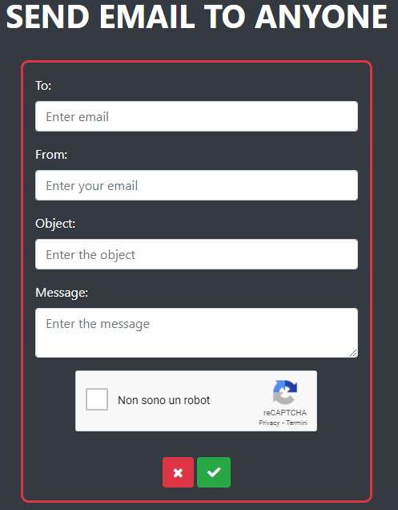
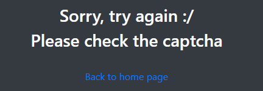

# SendEmail
PHP script to send email to anyone. Includes **Bootstrap** and **Google reCAPTCHA v2**.

## Screenshots

*The main form where insert data.*

---

*Confirm page*

---

*Error code when the reCAPTCHA is not resolved*
